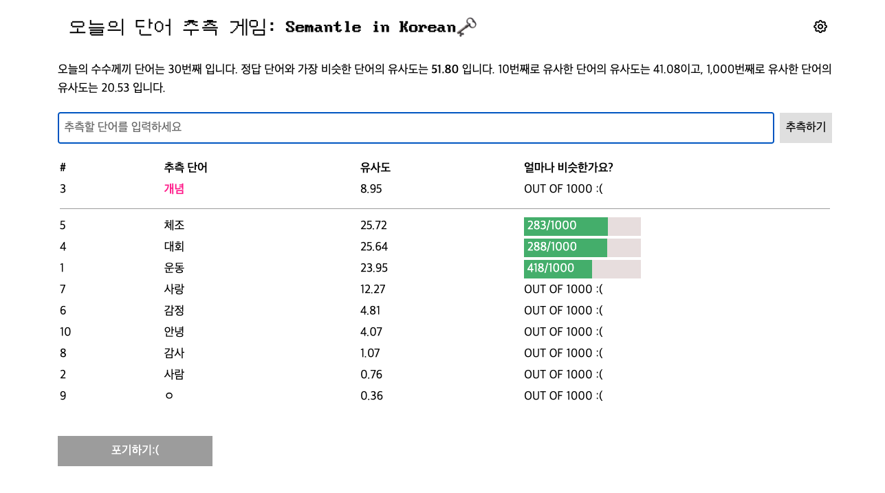

# Semantle in Korean: 단어 추측 게임

Semantle is a Python-based tool for calculating semantic similarity scores between guessed and correct words in this project. The scores are represented as a number ranging from -100 to +100, with higher scores indicating greater degrees of similarity between the two words.
  

  
### Requriements

- Python 3.6 or higher
- FastText pre-trained with Common Crawl and Wikipedia data (can be downloaded from FastText website)
- Docker (optional, for running Semantle in a container)

  
### Notes on Bias

The FastText model used by Semantle is pre-trained with Common Crawl and Wikipedia data, which may introduce bias depending on the sources and quality of the data. It is recommended to evaluate the results of Semantle in the context of the data it was trained on.

In the project, when there is a guessed word in the 1,000 words that are most similar to the correct word, the word's similarity ranking is provided together.